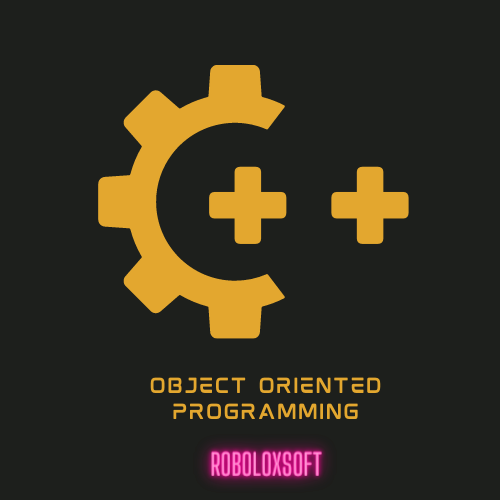
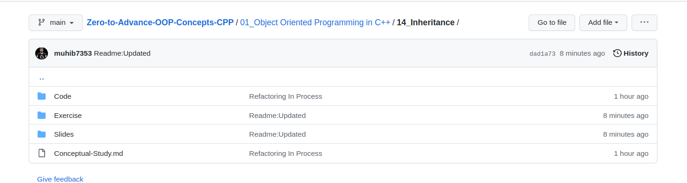

  

 
<h1 align="center" style="font-size: 120px;" >  C++ Object-Oriented Programming  
 Comprehensive Guide and Resource</h1>

 <h2>Contributors ⛓️</h2>

 

>This repository is a comprehensive resource and guide for those looking to learn or improve their understanding of Object-Oriented Programming (OOP) in C++. It includes a wide range of materials, including slides, code examples, exercises, and blog posts, all of which are designed to help you gain a deeper understanding of OOP concepts and techniques. Whether you are a beginner just starting out with C++ or an experienced programmer looking to expand your skills, this repository has something for you. With clear explanations, detailed examples, and plenty of opportunities to practice and apply your knowledge, this is the ultimate resource for learning OOP in C++.

# How to get benefit from this repository 💻
<!-- Comprehensive-Guide-and-Resource-of-OOP-In-CPP -->

If you want to learn any topic, simply choose one from the available options and start gaining knowledge from the provided resources on about that topic you choosed.

## Every Topic contain these provided resources in depth

  

# Table of Content 📄

If you're interested in seeing what I can do with OOP in C++, you've come to the right place! [My](https://github.com/muhib7353/Cpp-Data-Structures-and-Algorithms-An-In-Depth-Look) Github repository is full of deep dive concepts that showcase my skills and experience with object oriented design. From simple demos to interview level concepts , I hope you'll find something here that inspires you.

A langugae which containes these four core segments is referrred as **_Object-Oriented-Programming_** language.

- ## Classes and object :
  Classes have no exixtence in the memeory, it's only a blueprint.When we make an object of that class, then it should having the same memeory.Class is a user defined-data-Type, called as **_ABSTRACT_DATA_TYPE_**.
- ## Data Hiding and Encapsulation:
  Data hided from every another object is called data hiding. All the members of a class including data members and member functions are closed in a class like a capsule is referred to as Encapsulation. This feature opens a new term named as `Abstraction` which means that all the inner details are completetly ignored and we focus only on the working of the software.
- ## Inheritance:
  **_Do not reinvent the wheel_**.In programming the term used as : **Do not repeat the code⛔**.Inheritance has the code reuse-ability.Some features are inherited from the base class and given to the derived class.If any language does not support the inheritance then its not calle the Object oriented programming language its called the **\*Object-Based-Language**.
- ## Polymorphism
  Define as : Single interface having multiple functionalities.(same name different behaviour).
  It has two types :
  - Static
    Function overloading is done in static polymorphism.It has be achieved on the compile time also called the **_compile_time_binding_**.
  - Dynamic
    Function overriding is done in the dynamic polymorphism.It has be achieved on the run time also called the **_Run_Time_binding_**.

## Dynmaic Memory Allocation (DMA) 📕

Dynamic memory allocation in C++ allows for the allocation of memory at runtime, rather than at compile-time. This can be done using the "new" operator, which returns a pointer to the memory allocated. Memory allocated dynamically must be freed using the "delete" operator or a smart pointer to avoid memory leaks. C++ also provides "new[]" and "delete[]" for allocating and deallocating arrays dynamically.

1. [Dynamic Arrays](#dynamic-arrays)
2. [One Dimensional Dynamic Arrays](#one-dimensional-dynamic-arrays)
3. [Two Dimensional Dynamic Arrays](#two-dimensional-dynamic-arrays)
4. [Character Dynamic Arrays](#)

## Classes and Encapsulation 📥

In C++, classes are used to define objects and their behavior. Encapsulation is the mechanism of hiding the internal details of a class from the outside world, and only exposing a public interface. This allows for data abstraction and helps to maintain the integrity of the data by preventing unauthorized access.

5. [Classes and Static Objects](#classes-and-static-objects)
6. [Dynamic Objects and Access operator(->)](#dynamic-objects-and-access-operator)
7. [Static and Dynamic Object Function Types](#static-and-dynamic-object-function-types)
8. [Object Operators](#object-operators)
   - [Object Assigment operator (=)](#object-assignment-operater)
   - [Object relational operators ( ==, !=, <=, >=, <, > )](#object-relational-operaters)
   - [Object Arithematic operators (+, -, /, \*, %)](#object-arithematic-operators)
9. [Setters and Getters](#setters-and-getters)
10. [This keyword](#this-pointer-or-this-keyword-in-cpp)
11. [Scope Resolution operator (::)](#scope-resolution-operator)
12. [Member Functions](#member-functions)
13. [Constructors and Destructors](#constructors-and-destructors)
    - [Default Constructor]()
    - [Parameterized Constructors](#paramterized-constructor)
    - [Overloaded Constructor](#overloaded-constructor)
    - [Copy Constructor](#copy-constructor)
    - [Destructor](#destructors)
14. [Const in oop](#const-in-oop)
    - [const data member](#const-data-members)
    - [const member Function](#const-member-functions)
    - [const obj](#const-object)
15. [Static Keyword With Classes](#static-keyword-with-classes)
    - [static data member](#static-data-member)
    - [static member function](#static-member-function)
16. [Shallow vs Deep copy](#shallow-vs-deep-copy)
    - [Shallow copy](#shallow-copy)
    - [Deep or concrete copy](#deep-copy)
17. [Operators Overloading](#operator-overloading)
    - [Uniary Operators](#uniary-operators-1)
    - [Binary operators](#binary-operators-1)
    - [Assignment Operator](#arirthematic-assignment-operator)
    - [Friend Functions](#non-member-friend-functions)
18. [Array_Class](#array-class)

## Relationships among classes 🤝

There are several relationships that can exist between classes in C++, including: Inheritance, Composition, Association, Aggregation and Dependency. These relationship can be represented by UML diagrams and can help to model the relationships and interactions between different classes in a program.

19. [Object Relationships](#object-relationships)
    - [Aggregation](#aggregatatoion)
    - [Composition](#composition)
    - [Inheritance](#)

## Polymorphism 🧑‍🤝‍🧑

Polymorphism in C++ allows for objects of different classes to be treated as objects of a common base class. This is achieved through the use of virtual functions and function overloading. It enables a single function or method to operate on multiple types of data, and allows for more dynamic and extensible code

## Templates 🧞

Templates in C++ allow for the creation of generic functions and classes that can work with any data type. This is done by using template parameters, which are replaced by concrete types at compile time. It enables the creation of reusable and efficient code, and allows for compile-time type checking. This feature is known as template metaprogramming.

## Exception Handling 🔴

Exception handling in C++ provides a way to handle runtime errors, such as divide by zero or accessing an out of bounds array element. It allows the program to continue execution instead of terminating abruptly. It is done by using try-catch blocks, and throw keyword is used to throw an exception when an error occurs. Exception handling makes the code more robust and maintainable, and separates the error handling code from the normal code.

## File Handling 📁

File handling in C++ provides a way to read from and write to files on a disk. It uses a stream-based approach, where files are treated as streams of bytes. The C++ Standard Template Library (STL) provides several classes such as ofstream, ifstream and fstream for reading, writing and manipulating files. These classes have methods to open, read, write and close the files and can handle both text and binary files.

# 20% OFF Extra

> I'm excited to share these other resources and attached files with you! From tips and tricks to templates and tools, I hope these resources will help you boost your productivity and take your skills to the next level.

- [Basic Programming Fundamentals and Pointers](/00_Basic%20PF/)
- [Complete Bootcamp on OOP in C++ ](/05_Bootcamp_All_In_One/)
- [Books on OOP in C++](/04_Material/Books/)
- [Image Processing in C](/03_Side%20Concepts/Character%20Arrays%20Image%20Processing/)
- [For Each Loop in C++](/03_Side%20Concepts/For%20Each%20Loop/)
- [Header Files](/03_Side%20Concepts/Header%20Files/)

# 🤝 Contributing

"Feel free to contribute to this repository. If you want to add new features or resolve any issues, you can fork the repository and make changes to the code. If you only want to make changes to the file, you can create a pull request to the master branch. I will review it and, if it meets the necessary requirements, I will merge it into the branch. The same process applies for changes to the main branch as well."

# Contributors ⛓️

## Show your support

If this project was helpful to you, please consider giving it a ⭐️.
You can also follow my GitHub profile to stay updated on my latest projects:
<a href="https://github.com/muhib7353" target="blank">
@muhib7353
</a>

## 📝 License

Copyright © 2022 [Muhib Arshad](https://github.com/muhib7353).

This project is [MIT](/LICENSE.md) licensed.
